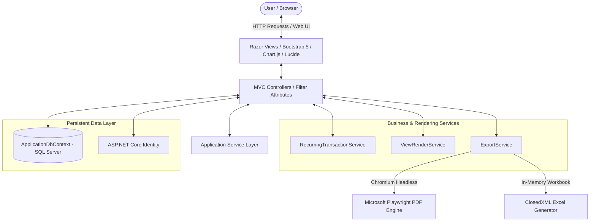

# <p align="center">✨ ExpenseTracker (ASP.NET Core MVC) ✨</p>

<p align="center">
  <strong>A premium, modern, and production-grade personal finance personal-use & SaaS-ready web application.</strong>
</p>

<p align="center">
  <a href="https://dotnet.microsoft.com/en-us/apps/aspnet/mvc"></a>
  <a href="https://learn.microsoft.com/en-us/ef/core/"></a>
  <a href="https://www.microsoft.com/en-us/sql-server"></a>
  <a href="https://getbootstrap.com/"></a>
  <a href="https://playwright.dev/dotnet/"></a>
  
</p>

---

## 🌟 What This App Does (At a Glance)

**ExpenseTracker** is a secure personal finance application where users can track incomes and expenses across custom categories, maintain wallet running balances in real time, configure automated recurring payments, monitor monthly budget caps, and generate pixel-perfect corporate reports.

> [!NOTE]
> **Data Security**: Designed with native multi-tenant isolation. All transactions, accounts, and budgets are securely scoped to individual users using their encrypted identity token (`UserId`), preventing any data leakage.

---

## 🎯 Core Features & Visual Highlights

| Module | Purpose | Visual / Technical Feature |
| :--- | :--- | :--- |
| 💳 **Account Management** | Multiple active wallets (Cash, Bank, Savings, Credit Cards) | Real-time balance recalculation with protective database delete rules. |
| 💸 **Ledger Entries** | Dual-track Expense & Income ledgers | Linked to distinct categories and wallets; balance adjustments happen automatically. |
| 📈 **Budget Planning** | Monthly expense limits set by category | Progress-bar metrics reflecting actual spending vs. target goals. |
| 🔄 **Recurring Engine** | Auto-generate future transactions (Daily/Weekly/Monthly/Yearly) | Opportunistic automation runs silently upon user dashboard load. |
| 📊 **Advanced Analytics** | Dynamic visual period reports | Beautifully crafted **Chart.js** trends, Lucide iconography, and summary cards. |
| 📤 **Enterprise Exports** | High-fidelity server-side reports | Headless **Playwright (Chromium)** PDFs & formatted **ClosedXML** Excel sheets. |

---

## 🛡️ Architecture & Technical Design

ExpenseTracker is built on a modern decoupled three-tier MVC architecture. High-overhead operations like document generation and automated transaction posting are offloaded to dedicated services.

### 📐 System Topology & Data Flow

This blueprint illustrates how components interact:



### 🧠 Core Business Logic Details
*   **Transactional Integrity**: Account balance operations use synchronous database locking. Adding a transaction updates `CurrentBalance` in real time, and deletions or editing revert historical modifications automatically to prevent math skew.
*   **Opportunistic Execution Engine**: The `RecurringTransactionService` processes pending recurring transactions when a user visits their dashboard, ensuring zero-overhead background scheduler costs while keeping data perfectly fresh.
*   **Complete Tenant Isolation**: Every ledger operation is automatically queried against a scoped `UserId` resolving from the authenticated ClaimsPrincipal, preventing data leaks across registered accounts.

---

## 📂 Repository Structure

Below is the directory map of the primary codebase:

```text
ExpenseTracker/
├── ExpenseTracker.slnx         # Modern Visual Studio Solution file
└── ExpenseTracker/             # Primary Project Source Code
    ├── Controllers/            # Route orchestration & authorization flows
    │   ├── AccountController.cs
    │   ├── ExpenseController.cs
    │   ├── IncomeController.cs
    │   ├── BudgetController.cs
    │   ├── WalletController.cs
    │   ├── RecurringTransactionController.cs
    │   ├── ReportController.cs
    │   └── ExportController.cs
    ├── Data/
    │   └── ApplicationDbContext.cs # Entity mapping and migration setups
    ├── Models/
    │   ├── Entities/           # Database Domain entities
    │   │   ├── Account.cs
    │   │   ├── Expense.cs
    │   │   ├── Income.cs
    │   │   ├── Category.cs
    │   │   ├── IncomeCategory.cs
    │   │   ├── Budget.cs
    │   │   ├── RecurringTransaction.cs
    │   │   └── ApplicationUser.cs
    │   └── ViewModels/         # UI Data transfer objects
    │       ├── DashboardViewModel.cs
    │       ├── MonthlySummaryViewModel.cs
    │       ├── FullReportViewModel.cs
    │       └── Exports/
    ├── Services/               # Encapsulated Business Logic layer
    │   ├── RecurringTransactionService.cs
    │   ├── ViewRenderService.cs
    │   └── ExportService.cs
    ├── Views/                  # Adaptive Razor pages
    │   ├── Shared/
    │   ├── Expense/
    │   ├── Income/
    │   ├── Budget/
    │   ├── Wallet/
    │   ├── Report/
    │   └── ExportTemplates/     # Document generation templates
    ├── wwwroot/                # Static assets
    │   ├── css/site.css        # Core custom styles (Adaptive Dark Theme)
    │   ├── js/site.js          # Reactive UI widgets & LocalStorage preference toggles
    │   └── lib/
    ├── Program.cs              # DI Services container setup & middleware
    └── appsettings.json        # Configurations (Connection strings, logging)
```

---

## 💾 Relational Data Model Schema

The database utilizes a clean relational topology mapped via EF Core migrations:

```
  ┌─────────────────┐       ┌─────────────────┐
  │ ApplicationUser │       │     Account     │
  └────────┬────────┘       └────────┬────────┘
           │                         │
           ├───────────┐             │
           ▼           ▼             ▼
      ┌─────────┐ ┌─────────┐   ┌─────────┐
      │ Expense │ │ Income  │◄──┤ Wallet  │
      └────┬────┘ └────┬────┘   └─────────┘
           │           │
           ▼           ▼
      ┌─────────┐ ┌─────────┐
      │Category │ │IncCateg │
      └─────────┘ └─────────┘
```

*   **`ApplicationUser`**: Standard Identity definition with a unique primary key.
*   **`Account`**: Represents a wallet holding a running ledger balance (`InitialBalance`, `CurrentBalance`). Contains constraints to block deletions if associated transactions exist.
*   **`Expense` / `Income`**: Individual transaction entries. Every record links directly to both an `Account` and a `Category` / `IncomeCategory`.
*   **`Budget`**: Configured caps scoped monthly against specific expense Categories.
*   **`RecurringTransaction`**: Rule engines tracking automated future expenses/incomes. Features automated frequency increments.

---

## ⚙️ Local Setup & Dependencies

Follow these steps to run the application on your local machine:

### 1. Prerequisites
*   **.NET SDK 10.0+**
*   **SQL Server** (LocalDB, Express, or Full instance)
*   **PowerShell** (for installing automated client browsers)

### 2. Database Connection Configuration
Modify `ExpenseTracker/appsettings.json` with your database credentials:
```json
"ConnectionStrings": {
  "DefaultConnection": "Server=YOUR_SERVER_NAME;Database=ExpenseTrackerDB;Trusted_Connection=True;TrustServerCertificate=True"
}
```

### 3. Dependency Resolution & Build
Restore NuGet packages and compile the project from the solution root:
```bash
dotnet restore
dotnet build
```

### 4. Apply Schema Migrations
Construct the database tables through EF Core:
```bash
dotnet ef database update --project ExpenseTracker
```

### 5. Headless PDF Engine Installation
The server-side PDF generator uses Microsoft Playwright to build responsive document formats. Install the headless Chromium browser utility:
```bash
pwsh bin/Debug/net10.0/playwright.ps1 install chromium
```

---

## 🚀 How to Run & Live Testing

### Launch Commands
Launch the ASP.NET Core server directly using the CLI:
```bash
dotnet run --project ExpenseTracker
```

Upon launching, the app runs at the following default development addresses:
*   **HTTPS**: `https://localhost:7139`
*   **HTTP**: `http://localhost:5015`

### 🔑 Instant Testing Accounts
If the database is initialized with zero user entries, the seeding service registers an instant demo account on startup:

> [!IMPORTANT]
> **Default Seed User Credentials**
> *   **Email Address**: `demo@example.com`
> *   **Password**: `Demo@123`
> 
> You can use these credentials to immediately log in and explore the pre-seeded dashboards and transactions.

---

## 🛠️ System Troubleshooting Guides

### 🔴 1. PDF Export Service Returns "Engine Unavailable"
*   **Cause**: The headless Chromium environment is missing or was installed under a different user scope.
*   **Solution**: Ensure you run `dotnet build` before running the Playwright install script. Run `pwsh bin/Debug/net10.0/playwright.ps1 install chromium` with administrator rights if directory permissions block the download.

### 🔴 2. Database Connection Failures
*   **Cause**: SQL Server service is stopped, or the connection parameters are incorrect.
*   **Solution**: Ensure your connection string includes `TrustServerCertificate=True` if you are using developer-signed local SSL certificates. Verify that the SQL Server service (`MSSQLSERVER` or `MSSQL$SQLEXPRESS`) is actively running in Windows Services.

### 🔴 3. Entity Framework Command Unrecognized
*   **Cause**: The EF CLI tool is not globally installed.
*   **Solution**: Run `dotnet tool install --global dotnet-ef` before trying to apply database updates.

### 🔴 4. "File in Use" Lock on DLLs
*   **Cause**: An active debugging session or hot-reload process is holding an exclusive handle.
*   **Solution**: Stop any active IIS Express, Kestrel, or Visual Studio processes before running updates or rebuilding the solution.

---

> [!TIP]
> **Onboarding Contributor Tip**: Start exploring by reviewing `Program.cs` to understand middleware bindings, navigate into `ExportController` + `ExportService` to inspect document rendering systems, and analyze `wwwroot/css/site.css` to grasp the adaptive CSS theme system.
