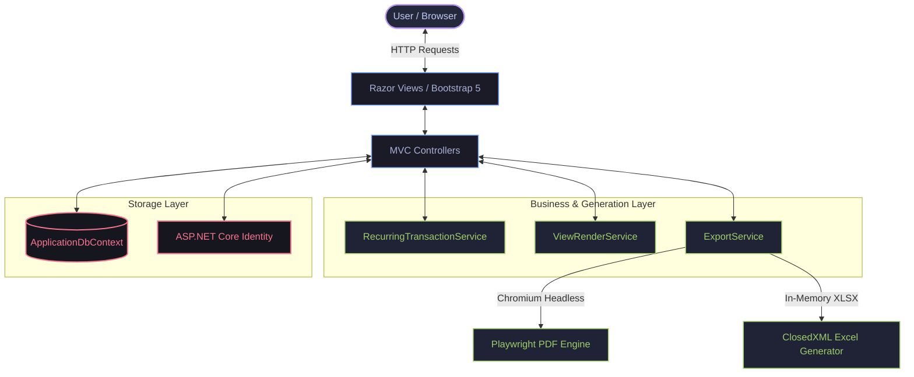

<div align="center">

# 💎 ExpenseTracker

### *A premium, high-fidelity personal finance & SaaS-ready core application built with ASP.NET Core 10.*

[](https://dotnet.microsoft.com/en-us/apps/aspnet/mvc)
[](https://learn.microsoft.com/en-us/ef/core/)
[](https://www.microsoft.com/en-us/sql-server)
[](https://getbootstrap.com/)
[](https://playwright.dev/dotnet/)


---
</div>

## ⚡ Quick Pitch

> **ExpenseTracker** is a secure, responsive personal finance platform featuring real-time multi-wallet balances, dynamic category budgets, automated recurring ledger postings, and professional server-side PDF and Excel export facilities.

> [!NOTE]
> **Data Security**: Designed with native multi-tenant isolation. All transactions, accounts, and budgets are securely scoped to individual users using their encrypted identity token (`UserId`), preventing any data leakage.

---

## 🎯 Core Capabilities

#### 💳 **1. Multi-Wallet Architecture**
*   Create distinct accounts (Cash, Bank, Savings, Credit Cards).
*   Live running balance calculations synchronized with ledger modifications.
*   Cascade protection prevents deleting wallets with active transaction history.

#### 💸 **2. Dual-Track Ledger**
*   Separate Expense & Income ledgers.
*   Automatic account balance increases/decreases upon entry creation.

#### 📈 **3. Dynamic Budgets**
*   Set monthly spending limits for individual categories.
*   Live progress indicators warning you when actual costs near target limits.

#### 🔄 **4. Auto-Recurring Payments**
*   Configure scheduled transactions (Daily, Weekly, Monthly, Yearly).
*   **Opportunistic Execution**: Runs silently upon user dashboard load, incurring zero backend daemon overhead.

#### 📤 **5. High-Fidelity Exports**
*   **Playwright (Chromium)** compiles Razor templates directly into styled A4 PDFs.
*   **ClosedXML** compiles formatted Excel sheets in-memory with automatic columns and totals.

---

## 📐 System Architecture

ExpenseTracker is built on a clean decoupled three-tier MVC architecture. High-overhead operations like document generation and automated transaction posting are offloaded to dedicated services.



---

## ⚙️ Quick Start

### 1. Configure Connection
Set your database connection string in `ExpenseTracker/appsettings.json`:
```json
"ConnectionStrings": {
  "DefaultConnection": "Server=YOUR_SERVER;Database=ExpenseTrackerDB;Trusted_Connection=True;TrustServerCertificate=True"
}
```

### 2. Install & Run Setup
Execute this sequence in your terminal:
```bash
# 1. Restore dependencies and build binaries
dotnet restore
dotnet build

# 2. Setup the Database Schema
dotnet ef database update --project ExpenseTracker

# 3. Install Playwright browser dependencies for PDF exports
pwsh bin/Debug/net10.0/playwright.ps1 install chromium
```

### 3. Launch the Server
```bash
dotnet run --project ExpenseTracker
```
*   **Secure Address**: [https://localhost:7139](https://localhost:7139)
*   **Standard Address**: [http://localhost:5015](http://localhost:5015)

> [!IMPORTANT]
> **Pre-Seeded Demo Account**:
> If the database is fresh, the application auto-seeds this developer account:
> *   **Email**: `demo@example.com`
> *   **Password**: `Demo@123`

---

## 📂 Repository Layout

```text
ExpenseTracker/
├── ExpenseTracker.slnx         # Unified solution definition
└── ExpenseTracker/             # Primary Project Source Code
    ├── Controllers/            # Route orchestration & authorization actions
    ├── Data/                   # DbContext & migrations mappings
    ├── Models/                 # Database Domain models & ViewModels
    ├── Services/               # Core business layers (Export / Recurring rules)
    ├── Views/                  # Adaptive Light/Dark theme Razor layouts
    ├── wwwroot/                # Adaptive site.css and site.js static files
    └── Program.cs              # DI containers setup & pipeline middleware
```

---

## 💾 Relational Data Model

*   **`ApplicationUser`**: Encrypted standard user credentials.
*   **`Account`**: Wallets tracking independent running balances (`InitialBalance`, `CurrentBalance`).
*   **`Expense` / `Income`**: Individual transaction entries linked to both an `Account` and a `Category`.
*   **`Budget`**: Category spending caps defined monthly.
*   **`RecurringTransaction`**: Rule engines tracking automated future expenses/incomes.

---

## 🛠️ Troubleshooting

#### **1. PDF Generation Fails**
*   **Cause**: Playwright's Chromium binary is missing.
*   **Fix**: Verify the project was built, then run `pwsh bin/Debug/net10.0/playwright.ps1 install chromium`.

#### **2. Database Connection Errors**
*   **Cause**: Local SQL Server instance is stopped or connection string lacks `TrustServerCertificate=True`.
*   **Fix**: Verify your LocalDB or Express instance is active in Windows Services.

#### **3. EF Commands Missing**
*   **Fix**: Run `dotnet tool install --global dotnet-ef` to add the required CLI tools.


