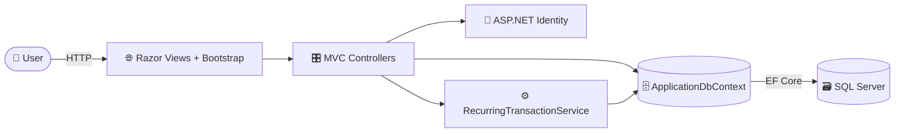
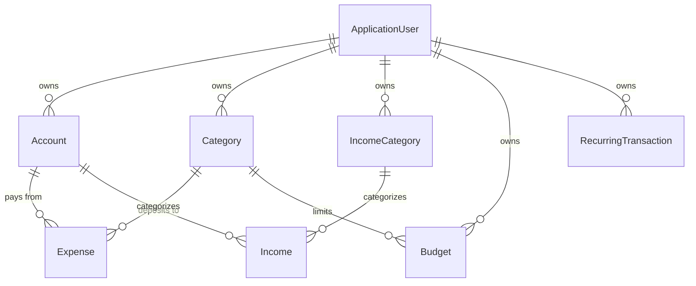

<div align="center">

# 💰 ExpenseTracker

### Beautifully organized personal finance tracking, built with ASP.NET Core MVC

Track income, expenses, wallets, budgets, recurring transactions, and reports — all in one secure, account-scoped dashboard.

<br/>

[](https://dotnet.microsoft.com/)
[](https://learn.microsoft.com/dotnet/csharp/)
[](https://learn.microsoft.com/aspnet/core/mvc/overview)
[](https://learn.microsoft.com/ef/core/)

[](https://www.microsoft.com/sql-server)
[](https://getbootstrap.com/)
[](https://www.chartjs.org/)
[](https://learn.microsoft.com/aspnet/core/security/authentication/identity)

<br/>

[Features](#-features) ·
[Tech Stack](#%EF%B8%8F-tech-stack) ·
[Architecture](#-architecture) ·
[Data Model](#-data-model) ·
[Getting Started](#-getting-started) ·
[Demo Account](#-demo-account)

</div>

---

## 📖 Overview

**ExpenseTracker** is a full-stack personal finance web application that helps users understand where their money goes, how balances move over time, and whether spending stays within budget.

It brings together authentication, wallet/account-level tracking, category management, budgeting, recurring entries, interactive dashboards, and date-range reports into a clean MVC experience. Every user works inside their own authenticated, isolated space, so financial data stays private, separated, and organized.

> 💡 The app even seeds a ready-to-use **demo account** on first run, so you can explore everything in seconds.

---

## ✨ Features

| | Feature | What it does |
|:--:|:--|:--|
| 👛 | **Multi-Wallet Accounts** | Manage cash, bank, credit card, savings, investment, and other accounts — each with live balance tracking. |
| 💸 | **Income & Expenses** | Record transactions against the right account and category, with dates and descriptions. |
| 🏷️ | **Categories** | Separate, customizable categories for both expenses and income sources. |
| 🎯 | **Budgets** | Set monthly budgets per category and instantly see usage %, with over-budget warnings. |
| 🔁 | **Recurring Transactions** | Automate rent, subscriptions, or salary — daily, weekly, monthly, or yearly, with start/end dates. |
| 📊 | **Dashboard & Charts** | Visual doughnut and bar charts (Chart.js) summarizing spending, income, and balances. |
| 🧾 | **Reports** | Generate full date-range reports with totals and net savings. |
| 🌗 | **Light / Dark Mode** | Theme-aware UI powered by CSS variables and `data-theme`. |
| 🔐 | **Secure Auth** | User registration and login via ASP.NET Core Identity, with per-user data scoping. |

---

## 🛠️ Tech Stack

| Layer | Technology |
|:--|:--|
| **Framework** | ASP.NET Core MVC on **.NET 10** |
| **Language** | C# (nullable + implicit usings enabled) |
| **Database** | SQL Server via **Entity Framework Core 10** (code-first migrations) |
| **Authentication** | ASP.NET Core Identity (`ApplicationUser`, cookie-based) |
| **UI** | Razor Views + Bootstrap + Bootstrap Icons |
| **Charts** | Chart.js |
| **Alerts** | SweetAlert2 |

---

## 🧭 Architecture



The request flow follows classic MVC: controllers handle requests, enforce per-user scoping through Identity, delegate recurring logic to a dedicated service layer, and persist everything through `ApplicationDbContext` / EF Core to SQL Server.

---

## 🗂️ Data Model



Key entities live in `ExpenseTracker/Models/Entities/`: `ApplicationUser`, `Account`, `Category`, `IncomeCategory`, `Expense`, `Income`, `Budget`, and `RecurringTransaction`.

---

## 🧱 Project Structure

```text
Expense_Tracker/
├── ExpenseTracker.slnx
└── ExpenseTracker/
    ├── Controllers/        # Account, Wallet, Expense, Income, Category,
    │                       # IncomeCategory, Budget, RecurringTransaction,
    │                       # Report, Home, Base
    ├── Data/               # ApplicationDbContext (EF Core)
    ├── Models/
    │   ├── Entities/       # Domain models (Account, Expense, Budget, ...)
    │   └── ViewModels/     # Dashboard, reports, charts, auth view models
    ├── Services/           # RecurringTransactionService
    ├── Migrations/         # EF Core migrations
    ├── Views/              # Razor views per area + Shared layout
    ├── wwwroot/            # CSS, JS, and client libraries (Bootstrap, jQuery)
    ├── Program.cs          # App bootstrap, DI, Identity, seeding
    └── appsettings.json    # Connection string & configuration
```

---

## 🗺️ App Areas

| Area | Responsibility |
|:--|:--|
| `Account` | Login, registration, and access control |
| `Wallet` | Wallet / account management with balances |
| `Expense` | Expense tracking, dashboard, charts, monthly summary |
| `Income` | Income tracking |
| `Category` | Expense categories |
| `IncomeCategory` | Income categories |
| `Budget` | Budget creation and editing |
| `RecurringTransaction` | Recurring transaction management |
| `Report` | Report generation and date-range views |
| `Home` | Landing pages and app entry points |

---

## 🔄 How It Works

1. A user **signs up or logs in** through the account pages.
2. They create **wallets, categories, income categories, and budgets**.
3. **Income and expense** transactions are added against the correct wallet and category — balances update automatically.
4. **Recurring entries** are processed by the service layer (e.g. `[Recurring] Rent`) based on their frequency.
5. **Dashboards, charts, summaries, and reports** turn the raw data into insights at a glance.

---

## 🚀 Getting Started

### Prerequisites

- [.NET 10 SDK](https://dotnet.microsoft.com/download)
- SQL Server (LocalDB, Express, or full)
- EF Core tools (`dotnet tool restore` — see `dotnet-tools.json`)

### Setup

```bash
# 1. Clone the repository
git clone https://github.com/AFROZ81/Expense_Tracker.git
cd Expense_Tracker

# 2. Restore dependencies (and EF Core tools)
dotnet restore
dotnet tool restore

# 3. Update the connection string in ExpenseTracker/appsettings.json
#    (DefaultConnection)

# 4. Apply the database migrations
dotnet ef database update --project ExpenseTracker

# 5. Run the application
dotnet run --project ExpenseTracker
```

Then open the printed `https://localhost:<port>` URL in your browser. 🎉

---

## ⚙️ Configuration

The app reads its database connection from the `DefaultConnection` entry in [`ExpenseTracker/appsettings.json`](ExpenseTracker/appsettings.json).

Identity is configured in [`Program.cs`](ExpenseTracker/Program.cs), including relaxed password rules (min length 8) and custom paths:

| Setting | Value |
|:--|:--|
| Login path | `/Account/Login` |
| Access denied path | `/Account/AccessDenied` |
| Default route | `{controller=Home}/{action=Index}/{id?}` |

---

## 🔑 Demo Account

On first run, if no users exist, the app **automatically seeds a demo user**:

| Field | Value |
|:--|:--|
| 📧 Email | `demo@example.com` |
| 🔒 Password | `Demo@123` |

Use it to explore the app right after the first database setup.

---

## 📝 Notes

- The UI uses **Razor views + Bootstrap** for a responsive interface, with **light/dark theming** via CSS variables.
- All financial data is **scoped to the authenticated user**.
- **Recurring transactions** are handled through a dedicated service layer (`RecurringTransactionService`).
- Charts are rendered client-side with **Chart.js**, and friendly confirmations use **SweetAlert2**.

---

## 📄 License

No license has been specified yet. Add one if you plan to publish or share the project publicly.

<div align="center">

<br/>

Made with ❤️ and ASP.NET Core MVC

</div>
